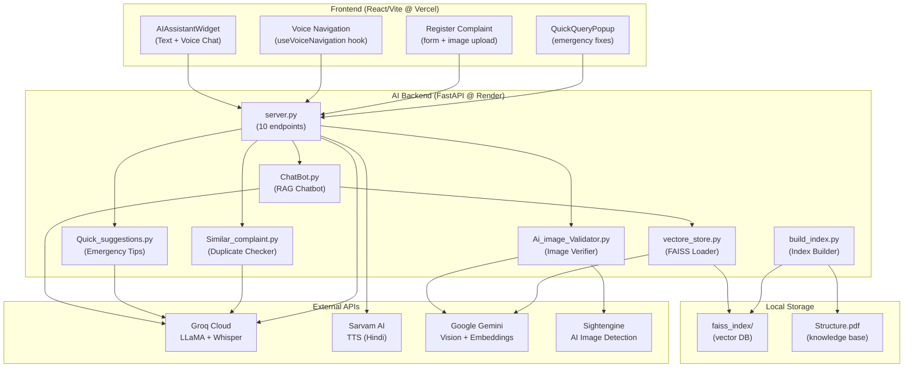

# CivicSync AI Backend – Complete Walkthrough

## Architecture Overview



---

## Tech Stack

| Layer | Technology | Purpose |
|---|---|---|
| **Web Framework** | FastAPI + Uvicorn | Async REST API server |
| **LLM (Primary)** | Groq LLaMA 3.3-70b-versatile | RAG chatbot, intent routing, form extraction |
| **LLM (Fast)** | Groq LLaMA 3.1-8b-instant | Quick fixes, duplicate detection |
| **STT** | Groq Whisper large-v3 | Speech-to-text transcription |
| **TTS** | Sarvam AI (bulbul:v2) | Hindi text-to-speech |
| **Vision** | Google Gemini 2.5 Flash | Image-vs-complaint verification |
| **AI Detection** | Sightengine API | Detect AI-generated images |
| **Embeddings** | Google gemini-embedding-001 | Document vectorization |
| **Vector DB** | FAISS (local) | Similarity search for RAG |
| **Document Loader** | LangChain PyPDFLoader | PDF parsing for knowledge base |
| **HTTP Client** | httpx | Async/sync API calls to external services |

---

## File-by-File Breakdown

### [server.py](file:///c:/Users/tanis/OneDrive/Documents/Suvidha/Code1/civicsync-new/ai_backend/server.py) – Main API Server (409 lines)

The central FastAPI application. Registers all endpoints and proxies to external APIs.

**Key config:**
- CORS allows `civicsync-new.vercel.app` + `localhost:5173`
- Runs on `$PORT` (cloud-compatible) or defaults to `8000`

---

### [ChatBot.py](file:///c:/Users/tanis/OneDrive/Documents/Suvidha/Code1/civicsync-new/ai_backend/ChatBot.py) – RAG Chatbot (78 lines)

**Function:** [Query_answer(query: str) -> dict](file:///c:/Users/tanis/OneDrive/Documents/Suvidha/Code1/civicsync-new/ai_backend/ChatBot.py#13-79)

**Flow:**
1. Searches FAISS vectorstore for top 3 most relevant document chunks
2. Sends those chunks + user query to Groq LLaMA 3.3-70b-versatile
3. Returns `{"answer": "plain text response"}`

**Model:** `llama-3.3-70b-versatile` (needs strong reasoning for RAG)
**Temperature:** 0.3 | **Max tokens:** 1024

---

### [Quick_suggestions.py](file:///c:/Users/tanis/OneDrive/Documents/Suvidha/Code1/civicsync-new/ai_backend/Quick_suggestions.py) – Emergency Tips (64 lines)

**Function:** [get_quick_fix(user_query: str) -> dict](file:///c:/Users/tanis/OneDrive/Documents/Suvidha/Code1/civicsync-new/ai_backend/Quick_suggestions.py#12-64)

**Flow:**
1. Takes a complaint description (e.g. "gas leak in kitchen")
2. Sends to Groq LLaMA 3.1-8b-instant for immediate safety advice
3. Returns `{"quick_fix_instructions": [...], "safety_warning": "..."}`

**Model:** `llama-3.1-8b-instant` (fast, simple classification task)
**Temperature:** 0.3 | **Max tokens:** 512

---

### [Similar_complaint.py](file:///c:/Users/tanis/OneDrive/Documents/Suvidha/Code1/civicsync-new/ai_backend/Similar_complaint.py) – Duplicate Checker (59 lines)

**Function:** [check_complaint(new_complaint: str, history: list) -> dict](file:///c:/Users/tanis/OneDrive/Documents/Suvidha/Code1/civicsync-new/ai_backend/Similar_complaint.py#12-59)

**Flow:**
1. Compares new complaint against a list of existing complaints
2. Uses LLM for semantic similarity (not exact match)
3. Returns `{"is_duplicate": true/false, "result": "already there"/"not done"}`

**Model:** `llama-3.1-8b-instant` (fast classification)
**Temperature:** 0.1 | **Max tokens:** 128

---

### [Ai_image_Validator.py](file:///c:/Users/tanis/OneDrive/Documents/Suvidha/Code1/civicsync-new/ai_backend/Ai_image_Validator.py) – Image Verifier (119 lines)

**Function:** [process_complaint(image_path, complaint_text) -> dict](file:///c:/Users/tanis/OneDrive/Documents/Suvidha/Code1/civicsync-new/ai_backend/Ai_image_Validator.py#98-119)

**Two-step verification pipeline:**

| Step | API | Purpose |
|---|---|---|
| 1 | Sightengine | Checks if image is AI-generated (score > 0.60 = rejected) |
| 2 | Gemini 2.5 Flash | Compares image content against complaint text |

**Possible results:**
- `"Ai_Generated"` – Image was AI-generated (fake)
- `"true complaint"` – Image matches complaint
- `"unambiguous complaint"` – Cannot visually verify (e.g. power outage)
- `"fake complaint"` – Image contradicts complaint

**Why Gemini?** Only model with vision capability in the stack.

---

### [vectore_store.py](file:///c:/Users/tanis/OneDrive/Documents/Suvidha/Code1/civicsync-new/ai_backend/vectore_store.py) – FAISS Loader (17 lines)

Loads the pre-built FAISS vector index from disk using Google `gemini-embedding-001` embeddings.

**Used by:** [ChatBot.py](file:///c:/Users/tanis/OneDrive/Documents/Suvidha/Code1/civicsync-new/ai_backend/ChatBot.py) for RAG similarity search.

---

### [build_index.py](file:///c:/Users/tanis/OneDrive/Documents/Suvidha/Code1/civicsync-new/ai_backend/build_index.py) – Index Builder (29 lines)

**Run once** to build the FAISS index:
1. Loads [Structure.pdf](file:///c:/Users/tanis/OneDrive/Documents/Suvidha/Code1/civicsync-new/ai_backend/Structure.pdf) using PyPDFLoader
2. Splits into chunks (300 chars, 80 overlap)
3. Embeds with `gemini-embedding-001`
4. Saves to `faiss_index/` directory

**When to re-run:** Only when [Structure.pdf](file:///c:/Users/tanis/OneDrive/Documents/Suvidha/Code1/civicsync-new/ai_backend/Structure.pdf) is updated.

---

## All API Endpoints

### Core Features

| Method | Endpoint | Input | Output | Used By |
|---|---|---|---|---|
| `POST` | `/get-answer` | `{"que": "text"}` | `{"answer": "..."}` | AI Chat Widget (text) |
| `POST` | `/get-fix` | `{"query": "text"}` | `{"quick_fix_instructions": [...], "safety_warning": "..."}` | QuickQueryPopup |
| `POST` | `/similar-complaint` | `{"complaint": "text", "prev_complaint": [...]}` | `{"is_duplicate": bool, "result": "..."}` | Complaint Form |
| `POST` | `/verify_complaint` | `FormData: complaint_text + image` | `{"status": "true complaint"/"fake complaint"/"Ai_Generated"}` | Complaint Form |

### Voice Navigation

| Method | Endpoint | Input | Output | Used By |
|---|---|---|---|---|
| `POST` | `/voice/tts` | `{"text": "...", "language": "hi-IN"}` | `{"audio_base64": "..."}` | Voice Nav Hook |
| `POST` | `/voice/stt` | `FormData: audio file` | `{"text": "transcribed text"}` | Voice Nav Hook |
| `POST` | `/voice/intent` | `{"current_route": "...", "valid_actions": [...], "user_text": "..."}` | `{"action": "navigate"/"navigate_and_fill"/"stay", "target": "...", "speak": "...", "form_data": {...}}` | Voice Nav Hook |
| `POST` | `/voice/fill-form` | `{"transcript": "...", "form_type": "complaint"}` | `{"form_data": {...}}` | Standalone form fill |

### Voice RAG Chat

| Method | Endpoint | Input | Output | Used By |
|---|---|---|---|---|
| `POST` | `/voice/chat` | `FormData: audio file` | `{"user_text": "...", "answer": "...", "audio_base64": "..."}` | AI Chat Widget (voice) |

---

## Data Flow Diagrams

### RAG Chatbot (Text)
```
User types question → /get-answer → ChatBot.py
  → FAISS similarity_search(query, k=3) → top 3 doc chunks
  → Groq LLaMA 70b (system prompt + context + query) → {"answer": "..."}
```

### RAG Chatbot (Voice)
```
User speaks → MediaRecorder → /voice/chat
  → Groq Whisper STT → transcribed text
  → ChatBot.py RAG pipeline → answer text
  → Sarvam TTS → audio base64
  → Returns {user_text, answer, audio_base64}
```

### Voice Navigation
```
Page loads → TTS greeting → Mic listens → Groq Whisper STT
  → /voice/intent (LLaMA 70b)
  → navigate: go to route
  → navigate_and_fill: go to route + auto-fill form fields
  → stay: re-prompt user
```

### Complaint Image Verification
```
User uploads image + text → /verify_complaint
  → Step 1: Sightengine (AI-generated check, score > 0.60 = reject)
  → Step 2: Gemini 2.5 Flash (image vs complaint text match)
  → Returns status
```

---

## Environment Variables

| Variable | Used By | Purpose |
|---|---|---|
| `GROQ_API_KEY` | ChatBot, Quick_suggestions, Similar_complaint, server.py | LLaMA + Whisper API access |
| `SARVAM_API_KEY` | server.py (TTS endpoints) | Hindi text-to-speech |
| `GOOGLE_API_KEY` | Ai_image_Validator, vectore_store, build_index | Gemini vision + embeddings |
| `SIGHT_ENGINE_API_KEY` | Ai_image_Validator | AI-generated image detection |
| `SIGHT_ENGINE_API_USER` | Ai_image_Validator | Sightengine account ID |
| `PORT` | server.py | Cloud deployment port (default: 8000) |

---

## Model Selection Rationale

| Model | Tasks | Why This Model |
|---|---|---|
| **LLaMA 3.3-70b-versatile** | RAG chatbot, intent routing, form extraction | Complex reasoning, handles Hindi/Hinglish, accurate extraction |
| **LLaMA 3.1-8b-instant** | Quick fixes, duplicate detection | Simple classification, very fast (< 1s), low cost |
| **Whisper large-v3** (Groq) | Speech-to-text | Best multilingual STT, handles Hindi/English mix |
| **Gemini 2.5 Flash** | Image verification | Only option with vision capability in free tier |
| **gemini-embedding-001** | Document embeddings | High quality embeddings for FAISS, Groq has no embedding model |
| **Sarvam bulbul:v2** | Text-to-speech | Native Hindi TTS, natural Indian voice |

---

## Startup Flow

```bash
# start.sh
uvicorn server:app --host 0.0.0.0 --port $PORT
```

On startup:
1. [server.py](file:///c:/Users/tanis/OneDrive/Documents/Suvidha/Code1/civicsync-new/ai_backend/server.py) loads, imports all modules
2. [vectore_store.py](file:///c:/Users/tanis/OneDrive/Documents/Suvidha/Code1/civicsync-new/ai_backend/vectore_store.py) loads FAISS index from `faiss_index/` into memory
3. CORS middleware configured
4. All 10 endpoints registered
5. Server listens on `0.0.0.0:$PORT`
